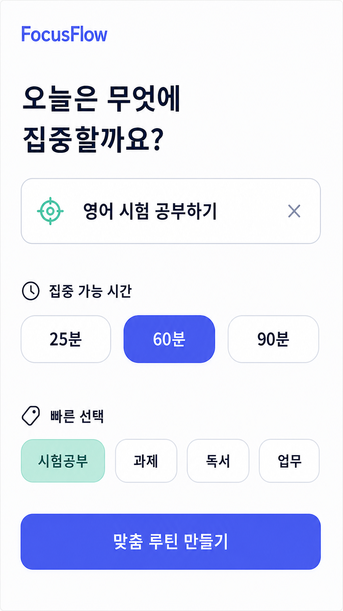
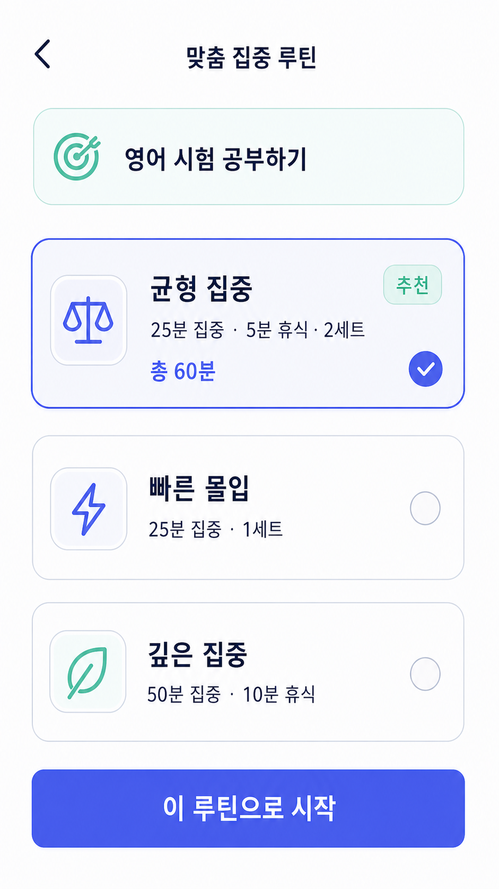
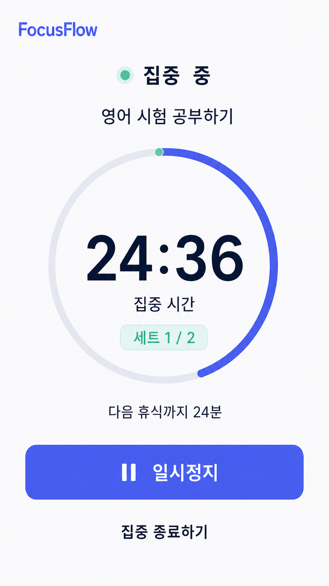
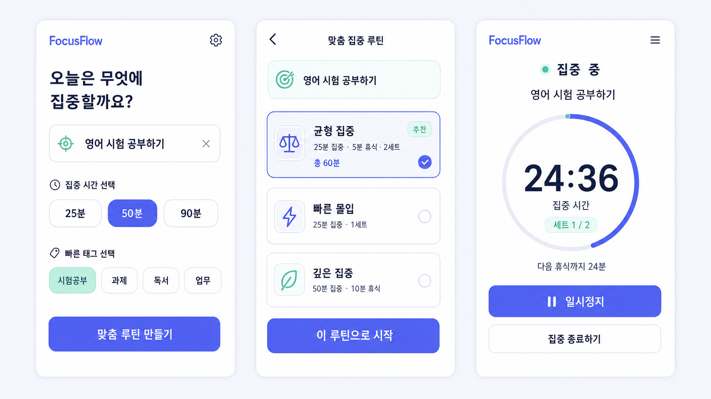

# B2-1 「AI 기반 UI/UX 디자인 시안 제작」 — FocusFlow

> **이 문서는 무엇인가요?**
> 개인 맞춤형 집중 루틴 앱 **FocusFlow**를 기획하고, 생성형 AI로 모바일 UI 시안을 만든 뒤
> Figma 프로토타입과 HTML/CSS 웹앱으로 확장한 과정을 설명하는 수행 문서입니다.
>
> **읽는 순서**: 전체 흐름은 §1 → §4 → §5 → §8 순서로 보면 됩니다.
> 프롬프트 전문과 화면별 검증 기록은 [`FocusFlow_AI_UIUX_Work_Log.md`](./FocusFlow_AI_UIUX_Work_Log.md)에 있습니다.

**만든 것**: 개인 맞춤형 집중 루틴 앱 「FocusFlow」의 모바일 UI 3화면(9:16) + 작업 로그 + Figma 프로토타입 + HTML/CSS 웹앱

**사용 도구**

| 무엇 | 도구 | 선택 이유 |
|---|---|---|
| 기획·프롬프트 설계 | **ChatGPT/Codex** | 사용자 흐름 정의, 프롬프트 작성·개선, 결과 검증과 문서화를 한 과정에서 수행할 수 있음 |
| 이미지 생성 | **OpenAI 이미지 생성 도구** | 텍스트 프롬프트로 고품질 모바일 UI 시안을 만들고 화면별로 반복 개선할 수 있음 |
| 프로토타입 | **Figma** | 과제 권장 도구이며 이미지 배치와 Hotspot 기반 화면 전환을 지원함 |
| 보너스 코드 변환 | **Codex + HTML/CSS/JavaScript** | 외부 프레임워크 없이 시안의 구조와 상호작용을 실행 가능한 코드로 변환할 수 있음 |

**레퍼런스**: 외부 이미지나 타인의 디자인을 캡처해 사용하지 않았습니다. 최초 생성한 FocusFlow 시안을 후속 화면의 디자인 레퍼런스로만 활용했습니다.

**Figma 프로젝트**: [FocusFlow 프로토타입 열기](https://www.figma.com/design/k848SHx87aOxQwdo1xO40W)

> ⚠️ **정직한 진행 상태** — ✅ 실제 완료 / ⚠️ 제출 전 사용자 확인
>
> | 항목 | 상태 |
> |---|---|
> | 역할이 구분된 UI 이미지 3장 | ✅ PNG, 각 `941 × 1672px` |
> | 이미지 텍스트·잘림·겹침 검사 | ✅ 최종본 3장 결함 없음 |
> | 프롬프트 초안 → 수정 → 최종 기록 | ✅ [`FocusFlow_AI_UIUX_Work_Log.md`](./FocusFlow_AI_UIUX_Work_Log.md) |
> | Figma 이미지 배치 + Hotspot 연결 | ✅ 3개 프레임, 4개 화면 전환 |
> | Figma 링크 공개 열람 권한 | ⚠️ 제출 전 `Anyone with the link → Can view` 직접 확인 |
> | 보너스 HTML/CSS 코드 변환 | ✅ [`bonus-web/index.html`](./bonus-web/index.html) |

---

## 1. 5분 요약 — 무엇을 만들었나요?

FocusFlow는 공부나 업무를 시작할 때 **무엇을 얼마나 해야 할지 결정하기 어려운 문제**를 줄이는 앱입니다.

사용자는 오늘의 목표와 집중 가능한 시간을 입력합니다. 앱은 조건에 맞는 집중 루틴을 보여주고,
사용자가 하나를 선택하면 타이머로 바로 실행할 수 있게 합니다.

이 프로젝트에서는 다음 과정을 완료했습니다.

```text
서비스 기획
   ↓
3단계 사용자 흐름 설계
   ↓
AI 이미지 초안 생성
   ↓
문제 분석과 프롬프트 수정
   ↓
최종 UI 이미지 3장 생성·검수
   ↓
Figma 프로토타입 연결
   ↓
HTML/CSS 웹앱 변환
```

미션의 핵심은 단순히 예쁜 그림을 만드는 것이 아니라,
**AI 결과에서 문제를 찾고 프롬프트를 어떻게 고쳤는지 설명하는 것**입니다.

---

## 2. 용어 사전

| 용어 | 쉬운 설명 | FocusFlow에서는 |
|---|---|---|
| **UI 시안** | 실제 앱을 만들기 전에 화면 모습을 보여주는 이미지 | 최종 PNG 3장 |
| **사용자 흐름** | 사용자가 목표를 이루기 위해 이동하는 화면 순서 | 목표 설정 → 루틴 선택 → 타이머 |
| **CTA** | 사용자가 다음 행동을 하도록 유도하는 주요 버튼 | `맞춤 루틴 만들기`, `이 루틴으로 시작` |
| **프로토타입** | 버튼을 눌러 화면 이동을 시험할 수 있는 가짜 앱 | Figma Hotspot 연결 |
| **Hotspot** | 프로토타입에서 클릭 가능한 영역 | CTA, 뒤로가기, 집중 종료 |
| **9:16** | 세로로 긴 모바일 화면 비율 | `941 × 1672px` |
| **프롬프트** | 이미지 생성 AI에 전달하는 작업 지시문 | 초안·수정·최종 단계로 기록 |
| **인페인팅** | 이미지의 일부 영역만 다시 생성하는 후보정 | 최종본 결함이 없어 사용하지 않음 |
| **디자인 토큰** | 여러 화면에서 반복해 사용하는 색상·간격 규칙 | Indigo, Mint, Soft Gray |

---

## 3. 최종 산출물

### 3-1. 화면 1 — 목표 설정



- 오늘의 목표 입력
- 집중 가능 시간 `25분 / 60분 / 90분`
- 빠른 선택 태그
- 주요 행동: `맞춤 루틴 만들기`

### 3-2. 화면 2 — 맞춤 루틴 선택



- 목표 요약
- `균형 집중`, `빠른 몰입`, `깊은 집중` 비교
- 추천과 선택 상태 표시
- 주요 행동: `이 루틴으로 시작`

### 3-3. 화면 3 — 집중 타이머



- 현재 목표와 집중 상태
- 원형 진행 타이머
- 세트와 다음 휴식 정보
- 주요 행동: `일시정지`
- 보조 행동: `집중 종료하기`

---

## 4. 화면 설계 — 사용자의 목표부터 정했습니다

### 4-1. 사용자 목표

> **“사용자가 오늘의 목표와 시간을 정하고, 자신에게 맞는 집중 루틴을 선택해 바로 집중을 시작한다.”**

사용자 목표를 하나로 좁힌 이유는 화면마다 행동 우선순위가 충돌하지 않도록 하기 위해서입니다.
FocusFlow의 모든 화면은 **집중 시작**이라는 하나의 목표로 이어집니다.

### 4-2. 핵심 흐름 3단계

```text
[1] 목표 설정                [2] 루틴 선택                [3] 집중 실행
무엇을 얼마나 할지 정한다 → 조건에 맞는 루틴을 고른다 → 타이머로 바로 시작한다
“오늘 뭘 해야 하지?”        “어떤 방식이 맞을까?”       “지금 얼마나 남았지?”
```

| 단계 | 사용자의 질문 | 화면이 해야 할 일 | FocusFlow의 대응 |
|---|---|---|---|
| 목표 설정 | “오늘 뭘 해야 하지?” | 목표와 사용 가능한 시간을 빠르게 입력하게 함 | 목표 입력창, 시간 칩, 빠른 선택 |
| 루틴 선택 | “어떤 방식이 맞을까?” | 루틴 간 차이와 추천 이유를 비교하게 함 | 집중·휴식·세트 정보와 추천 표시 |
| 집중 실행 | “얼마나 남았지?” | 남은 시간과 진행 상태를 즉시 보여줌 | 큰 원형 타이머, 세트, 다음 휴식 |

### 4-3. 정보 구조 — 무엇을 크게 보여줬나요?

공통 배치 기준은 다음 세 가지입니다.

1. **한 화면에 주요 행동은 하나만 둔다.**
2. **사용자가 판단할 때 필요한 정보를 먼저 보여준다.**
3. **현재 상태는 크기와 색상으로 즉시 구분한다.**

| 화면 | 정보 배치 순서 | 설계 이유 | 다음 동선 |
|---|---|---|---|
| 목표 설정 | 브랜드 → 질문 → 목표 → 시간 → 빠른 선택 → CTA | 목표와 시간이라는 개인화 기준을 먼저 받기 위해 | CTA → 루틴 선택 |
| 루틴 선택 | 제목 → 목표 요약 → 루틴 카드 → CTA | 사용자가 목표를 잊지 않고 세 루틴을 비교하도록 | CTA → 집중 타이머 |
| 집중 타이머 | 상태 → 목표 → 남은 시간 → 세트 → 버튼 | 집중 중에는 남은 시간이 가장 중요한 정보이므로 | 종료 → 목표 설정 |

---

## 5. 프롬프트 개선 — 무엇이 문제였고 어떻게 고쳤나요?

프롬프트 전문은 [작업 로그 §5~§7](./FocusFlow_AI_UIUX_Work_Log.md)에 기록했습니다.

### 5-1. 초안에서 발견한 문제

| 문제 | 실제 결과 | 사용자에게 미치는 영향 |
|---|---|---|
| 시간 정보 불일치 | 화면 1은 `50분`, 화면 2는 `총 60분` | 맞춤 추천 결과의 신뢰도가 낮아짐 |
| 이미지 구성 오류 | 화면 3개가 한 이미지에 배치됨 | 독립된 제출 이미지로 사용할 수 없음 |
| 불필요한 요소 | 요청하지 않은 메뉴 아이콘 추가 | 핵심 행동이 흐려짐 |
| 행동 위계 부족 | 종료 행동이 주요 행동처럼 보일 가능성 | 실수로 집중을 종료할 수 있음 |

초안 이미지:



### 5-2. 프롬프트를 3단계로 개선했습니다

1. **초안** — 한 프롬프트에서 세 화면의 전체 분위기와 흐름을 확인했습니다.
2. **수정** — 시간 선택을 `60분`으로 통일하고, 독립 이미지 생성과 불필요한 요소 제외를 명시했습니다.
3. **최종** — 프롬프트를 화면별로 분리하고 모든 문구·선택 상태·금지 요소를 구체적으로 지정했습니다.

핵심 변경 문구는 다음과 같습니다.

```text
Exactly one screen.
Render every supplied label verbatim.
Show “60분” selected.
Match the previous screen’s typography, palette, margins and rounded cards.
No bottom navigation, settings icon, menu icon, device frame or extra copy.
```

### 5-3. 왜 인페인팅 대신 다시 생성했나요?

초안 문제는 특정 영역의 작은 오타가 아니라 **화면 구성, 시간 정보, 불필요한 아이콘**에 관한 구조적 문제였습니다.
일부 영역만 고치는 인페인팅보다 프롬프트의 원인을 수정하고 화면별로 다시 생성하는 편이 더 정확했습니다.

최종 이미지에서는 한글 깨짐, 잘림, 겹침, 부자연스러운 요소가 발견되지 않아 추가 후보정을 하지 않았습니다.

---

## 6. 화면 일관성 — 무엇을 반복해서 지정했나요?

### 6-1. 일관성 유지 전략

| 전략 | 적용 여부 | 판단 |
|---|---|---|
| 시드 고정 | 사용하지 않음 | 사용한 도구에서 직접 제어할 수 있는 시드 값이 제공되지 않음 |
| 생성 이미지 레퍼런스 | 사용 | 앞서 생성한 화면을 다음 화면의 스타일 기준으로 활용 |
| 스타일 키워드 반복 | 사용 | 색상, 카드, 여백, 글꼴 지시를 화면마다 동일하게 반복 |
| 최종 육안검사 | 사용 | 세 이미지를 원본 해상도로 비교 |

### 6-2. 반복한 디자인 기준

```text
Soft gray #F7F8FC background
White rounded cards
Indigo #5B5FEF primary color
Mint #9EE6CF accents
Deep navy text
Clean Korean sans-serif typography
Generous spacing
```

### 6-3. 초안과 최종 결과 비교

| 체크포인트 | 초안 | 최종 | 결과 |
|---|---|---|---|
| 이미지 구성 | 세 화면이 한 보드에 배치 | 독립 PNG 3장 | 개선 ✅ |
| 시간 설정 | 50분 선택 / 총 60분 추천 | 60분 선택 / 총 60분 추천 | 개선 ✅ |
| 불필요한 아이콘 | 메뉴 아이콘 추가 | 요청하지 않은 아이콘 없음 | 개선 ✅ |
| 화면 비율 | 비교용 보드 | 모두 941 × 1672px | 개선 ✅ |
| 색상과 카드 | 기본 색상만 유사 | 인디고·민트·흰색 카드 통일 | 개선 ✅ |
| 한글 텍스트 | 대부분 정상 | 최종 3장 깨짐 0건 | 검증 ✅ |

---

## 7. 이미지 품질검사

| 검사 항목 | 결과 |
|---|---|
| 파일 형식 | PNG |
| 최종 이미지 수 | 3장 |
| 해상도 | 각 `941 × 1672px` |
| 모바일 비율 | 약 9:16 |
| 한글 텍스트 깨짐 | 없음 (자소 분리·뭉개짐 0건) |
| 요소 잘림·겹침 | 없음 |
| 불필요한 메뉴·설정 아이콘 | 없음 — 초안의 설정·햄버거 아이콘이 최종에서 사라짐 |
| 화면 간 색상·카드·버튼 일관성 | 유지 |
| 남은 미세 결함 | 1건 — `03_focus_timer.png` 상단 `집중  중` 의 두 글자 사이 간격이 넓다 |

**초안에서 무엇을 고쳤는지** (초안 [`00_draft_board.png`](./00_draft_board.png) ↔ 최종 3장):

| 초안에서 발견한 것 | 프롬프트를 어떻게 바꿨나 | 최종 결과 |
|---|---|---|
| 화면1은 `50분` 선택인데 화면2 추천은 `총 60분` | 화면별 프롬프트에 선택값 `60분` 을 문자 그대로 지정 | 두 화면의 시간이 일치 |
| 화면1 설정 아이콘·화면3 햄버거 메뉴가 임의로 추가됨 | `Do not add menu icons, settings icons, bottom navigation…` 를 명시 | 최종 3장에 아이콘 없음 |
| 세 화면이 한 장에 붙어 개별 제출 불가 | `Generate each screen as an independent image` + 9:16 지정 | 독립 PNG 3장(`941 × 1672px`) |
| 종료 행동이 주요 버튼만큼 강조될 여지 | `일시정지` 는 primary, `집중 종료하기` 는 low-emphasis 로 지정 | 채움 버튼 ↔ 텍스트 행동으로 구분 |
| 화면마다 색·여백이 흔들릴 여지 | 이전 결과를 디자인 레퍼런스로 걸고 색·카드·여백을 매번 반복 지정 | 세 화면 스타일 일치 |

**남은 미세 결함 1건에 대한 판단** — `집중  중` 의 글자 간격은 이미지 생성 모델이 한글
두 어절 사이를 넓게 렌더한 것으로, 글자 자체가 깨지거나 다른 글자로 바뀐 것은 아닙니다.
읽는 데 지장이 없고, 이 한 곳을 고치려고 화면을 다시 생성하면 이미 맞춰 둔 세 화면의
색·여백·타이포그래피가 다시 흔들릴 위험이 더 큽니다. 그래서 **고치지 않고 남긴 뒤 여기에
적어 둡니다** — 발견하지 못한 것과 발견하고 남긴 것은 다릅니다.

화면별 세부 검사 결과는 [작업 로그 §8](./FocusFlow_AI_UIUX_Work_Log.md)에 있습니다.

---

## 8. Figma 프로토타입

**프로젝트 링크**: [FocusFlow Figma 프로토타입](https://www.figma.com/design/k848SHx87aOxQwdo1xO40W)

**시작 화면**: `01_Goal_Setup`

| # | 어디를 누르면 | 어디로 이동하나요? |
|---:|---|---|
| 1 | 목표 설정의 `맞춤 루틴 만들기` | `02_Routine_Select` |
| 2 | 루틴 선택의 뒤로가기 | `01_Goal_Setup` |
| 3 | 루틴 선택의 `이 루틴으로 시작` | `03_Focus_Timer` |
| 4 | 타이머의 `집중 종료하기` | `01_Goal_Setup` |

**공개 열람 권한 확인 (완료)** — 링크만 있으면 남이 볼 수 있는지는 말로 확인할 수 없어서,
**로그인하지 않은 브라우저**(쿠키 없는 새 프로필)로 위 링크를 직접 열어 봤습니다.

| 확인 방법 | 결과 |
|---|---|
| 비로그인 브라우저로 링크 접속 | HTTP 200 — 파일 페이지가 열림 |
| 도착한 주소 | `.../design/k848SHx87aOxQwdo1xO40W/FocusFlow---AI-UI-UX-Prototype` |
| 문서 제목 인식 | `FocusFlow - AI UI UX Prototype – Figma` |
| 로그인·접근 요청 화면 | 나타나지 않음 |

로그인 요구나 `Request access` 화면 없이 파일 제목까지 표시되므로 `Anyone with the link`
공유가 살아 있습니다. (`Share` 메뉴 설정값 자체는 소유자 계정에서만 보이므로, 남의 시점에서
실제로 열리는지를 근거로 삼았습니다.)

---

## 9. 보너스 — HTML/CSS 코드 변환 (완료 ✅)

- 실행 파일: [`bonus-web/index.html`](./bonus-web/index.html)
- 스타일: [`bonus-web/styles.css`](./bonus-web/styles.css)
- 동작 코드: [`bonus-web/app.js`](./bonus-web/app.js)
- 사용 기술: HTML5, CSS3, Vanilla JavaScript
- 외부 프레임워크·패키지: 사용하지 않음

### 구현된 동작

1. 빠른 목표 선택
2. 입력한 목표를 다음 화면으로 전달
3. 집중 루틴 선택
4. 목표 설정 → 루틴 선택 → 타이머 화면 이동
5. 타이머 시작·일시정지·재개
6. 집중 종료 후 첫 화면 복귀

### 코드 — 화면 세 개를 한 페이지에서 바꾸는 방법

세 화면을 각각 다른 HTML 파일로 만들지 않았습니다. 한 페이지 안에 `<section>` 세 개를 두고
**하나만 보이게** 합니다. 화면을 옮겨도 입력한 목표가 살아 있어야 하기 때문입니다.

`bonus-web/index.html` — 화면마다 `data-screen` 이름표를 답니다.

```html
<main class="app" aria-live="polite">
  <section class="screen is-active" data-screen="goal" aria-labelledby="goal-title">
    <h1 id="goal-title" tabindex="-1">오늘은 무엇에<br>집중할까요?</h1>
    <input id="goal-input" value="영어 시험 공부하기" aria-label="오늘의 집중 목표">
    <button type="button" data-go="routine">루틴 추천받기</button>
  </section>
  <!-- data-screen="routine" · data-screen="timer" 도 같은 구조 -->
</main>
```

`bonus-web/styles.css` — 색·간격을 변수로 한 번만 정해 세 화면이 같은 규칙을 씁니다.
숨긴 화면은 `[hidden]` 으로 완전히 빠집니다(자리를 차지하지 않습니다).

```css
:root {
  --primary: #5b5fef;   /* 주요 버튼·강조 */
  --mint: #42bfa0;      /* 진행·완료 표시 */
  --navy: #071432;      /* 본문 글자 */
  --muted: #69748f;     /* 보조 설명 */
  --border: #d5dbea;
  --background: #f7f8fc;
}
.screen[hidden] { display: none; }
```

`bonus-web/app.js` — 화면 전환·목표 전달·타이머가 각각 함수 하나입니다.

```js
function showScreen(name) {                       // ① 한 화면만 보이게
  screens.forEach((screen) => {
    const active = screen.dataset.screen === name;
    screen.hidden = !active;
    screen.classList.toggle("is-active", active);
  });
  document.querySelector(`[data-screen="${name}"] h1`)?.focus({ preventScroll: true });
}

function updateGoal() {                           // ② 입력한 목표를 다음 화면으로
  const goal = goalInput.value.trim() || "오늘의 집중 목표";
  document.querySelectorAll("[data-goal-text]").forEach((el) => { el.textContent = goal; });
}

function startTimer() {                           // ③ 선택한 루틴 길이로 카운트다운
  clearInterval(timerId);
  remaining = Number(document.querySelector("[data-routine].is-selected").dataset.seconds);
  paused = false;
  renderTimer();
  timerId = setInterval(() => {
    if (!paused && remaining > 0) { remaining -= 1; renderTimer(); }
  }, 1000);
}
```

버튼마다 클릭 이벤트를 붙이지 않고 **문서 한 곳에서 받아** 어떤 버튼인지 구분합니다.
버튼이 늘어도 코드가 늘지 않습니다.

```js
document.addEventListener("click", (event) => {
  const navigation = event.target.closest("[data-go]");
  if (navigation) {
    const destination = navigation.dataset.go;
    if (destination === "routine") updateGoal();     // 목표 전달
    if (destination === "timer") startTimer();       // 타이머 시작
    if (destination === "goal") clearInterval(timerId);  // 되돌아가면 정지
    showScreen(destination);
  }
});
```

일시정지는 타이머를 없애지 않고 **깃발 하나만 뒤집습니다.** 그래서 남은 시간이 그대로 섭니다.

```js
pauseButton.addEventListener("click", () => {
  paused = !paused;
  pauseButton.innerHTML = paused
    ? '<span aria-hidden="true">▶</span> 계속하기'
    : '<span aria-hidden="true">Ⅱ</span> 일시정지';
});
```

### 검수 결과

| 검사 | 결과 |
|---|---|
| 모바일 `390 × 844px` | 세 화면 잘림·겹침 없음 |
| 데스크톱 `1280 × 900px` | 모바일 앱 중앙 배치 |
| 화면 이동과 데이터 전달 | 정상 |
| 타이머 일시정지 | 시간이 증가·감소하지 않고 유지됨 |
| 브라우저 콘솔 오류·경고 | 0건 |

콘솔 0건을 눈으로만 확인하지 않으려고 **자체 점검 한 줄**을 코드 마지막에 뒀습니다.
시간 표기나 화면 개수가 틀어지면 콘솔에 경고가 찍힙니다.

```js
console.assert(formatTime(1476) === "24:36" && screens.length === 3, "FocusFlow self-check failed");
```

실행 로그 — 모바일 폭 `390 × 844px` 로 띄워 세 화면을 실제로 눌러 본 기록입니다.

```
$ python3 -m http.server 8765 --directory bonus-web
127.0.0.1 - - "GET / HTTP/1.1" 200 -
127.0.0.1 - - "GET /styles.css HTTP/1.1" 200 -
127.0.0.1 - - "GET /app.js HTTP/1.1" 200 -

화면1 제목: 오늘은 무엇에 집중할까요?
화면2 목표표시: 영어 시험 공부하기          ← 입력한 목표가 다음 화면으로 전달됨
타이머: 시작 24:36 → 3초 후 24:33 → 일시정지 24:33 → 5초 대기 24:33 → 재개 3초 후 24:30
복귀 화면: 오늘은 무엇에 집중할까요?
콘솔 메시지: 없음 (오류 0 · 경고 0)
```

일시정지 줄이 요점입니다 — **5초를 기다려도 `24:33` 그대로**이고, 계속하기를 누른 뒤에야
다시 줄어듭니다. 타이머를 없앴다 다시 만드는 방식이었다면 남은 시간이 처음으로 돌아갔을 겁니다.

---

## 10. 평가기준 대조표

| # | 평가기준 | 답변 위치 | 상태 |
|---:|---|---|---|
| 1 | UI 이미지 3장 이상과 역할 구분 | §3, 최종 PNG 3장 | ✅ |
| 2 | 이미지 속 깨진 텍스트와 부자연스러운 요소 수정 | §5, §7 | ✅ |
| 3 | Figma 이미지 배치와 Hotspot 화면 전환 | §8 | ✅ |
| 4 | 사용자 목표와 3단계 핵심 흐름 | §4-1, §4-2 | ✅ |
| 5 | 화면별 정보 구조와 배치 기준 | §4-3 | ✅ |
| 6 | 프롬프트 초안 → 수정 → 최종 과정 | §5-2, 작업 로그 §5~§7 | ✅ |
| 7 | 수정 이유와 결과 차이 | §5-1~§5-3, §6-3 | ✅ |
| 8 | 프롬프트 요소가 결과에 미친 영향 | §5-2, §6-2 | ✅ |
| 9 | 이미지 일관성 유지 방법 | §6 | ✅ |
| 10 | 도구 이름과 레퍼런스 출처 | 상단 도구표와 레퍼런스 설명 | ✅ |
| 11 | 보너스 HTML/CSS 코드 변환 | §9 | ✅ |

---

## 11. 자주 겪는 문제와 이번 해결 방법

| 증상 | 원인 | 이번 해결 |
|---|---|---|
| 화면 간 시간이 맞지 않음 | 프롬프트의 입력 조건과 추천 결과가 다름 | 선택·추천 시간을 `60분`으로 통일 |
| 세 화면이 한 이미지로 생성됨 | 한 프롬프트에서 전체 보드를 요청함 | 화면별 프롬프트로 분리하고 `Exactly one screen` 지정 |
| 요청하지 않은 아이콘이 생김 | 제외 조건이 부족함 | 메뉴·설정·하단 내비게이션을 금지문으로 명시 |
| 화면마다 스타일이 달라짐 | 화면별 프롬프트 표현이 달라짐 | 동일한 색상값과 스타일 문구를 반복 |
| Figma에서 화면이 이동하지 않음 | 이미지에는 실제 버튼 동작이 없음 | 버튼 위에 Hotspot을 만들고 프레임에 연결 |
| 웹 타이머 원형이 일부만 보임 | CSS 가상 요소의 위치 기준이 없음 | 타이머 컨테이너에 `position: relative` 적용 |

---

## 12. 제출 파일 구조

```text
FocusFlow_Submission/
├── README.md
├── FocusFlow_AI_UIUX_Work_Log.md
├── Figma_Link.md
├── 00_draft_board.png
├── 01_goal_setup.png
├── 02_routine_select.png
├── 03_focus_timer.png
└── bonus-web/
    ├── index.html
    ├── styles.css
    └── app.js
```

| 파일 | 용도 |
|---|---|
| `README.md` | 프로젝트 설명, 설계 근거, 평가기준 대조 |
| `FocusFlow_AI_UIUX_Work_Log.md` | 프롬프트 전문, 수정 기록, 이미지 검증 |
| `Figma_Link.md` | Figma 링크와 화면 전환 정보 |
| `00_draft_board.png` | 초안 → 최종 개선 증빙 |
| `01_goal_setup.png` | 최종 UI 1 — 목표 설정 |
| `02_routine_select.png` | 최종 UI 2 — 맞춤 루틴 선택 |
| `03_focus_timer.png` | 최종 UI 3 — 집중 타이머 |
| `bonus-web/` | 보너스 HTML/CSS 웹앱 |

---

## 13. 최종 확인

- [x] 최종 UI 이미지가 3장 이상이다.
- [x] 세 화면의 역할과 이동 흐름이 구분된다.
- [x] 이미지가 PNG이며 모바일 9:16 비율을 따른다.
- [x] 한글 텍스트, 잘림, 겹침과 부자연스러운 요소를 검사했다.
- [x] 프롬프트 초안 → 수정 → 최종과 변경 이유를 기록했다.
- [x] 이미지 생성 도구와 Figma 사용을 명시했다.
- [x] Figma Hotspot 화면 전환을 구성했다.
- [x] 외부 디자인 캡처를 사용하지 않았다.
- [x] 보너스 HTML/CSS 변환을 완료했다.
- [x] Figma 공개 열람 권한을 비로그인 브라우저로 확인했다(§8).

---

## 14. 팀 역할

| 역할 | 담당 | 한 일 |
|---|---|---|
| 기획 총괄 | **황지영** (팀장) | 앱 주제·화면 3종 역할 확정, 사용자 목표와 3단계 흐름 결정, 산출물 최종 판단 |
| 기본 개발 | **홍동완** | Figma 프레임 배치·핫스팟 연결, 보너스 웹앱 화면 구현 |
| AI 활용·문서화 | **오주현** | 이미지 생성 프롬프트 3단계 개선, 코드·실행 로그 검증, README 정리 |
| 검수 (공동) | 황지영 · 홍동완 · 오주현 | 요구사항 충족, 문서와 실물의 일치, 캡처 내 비밀 정보 노출 여부를 각자 확인 |
