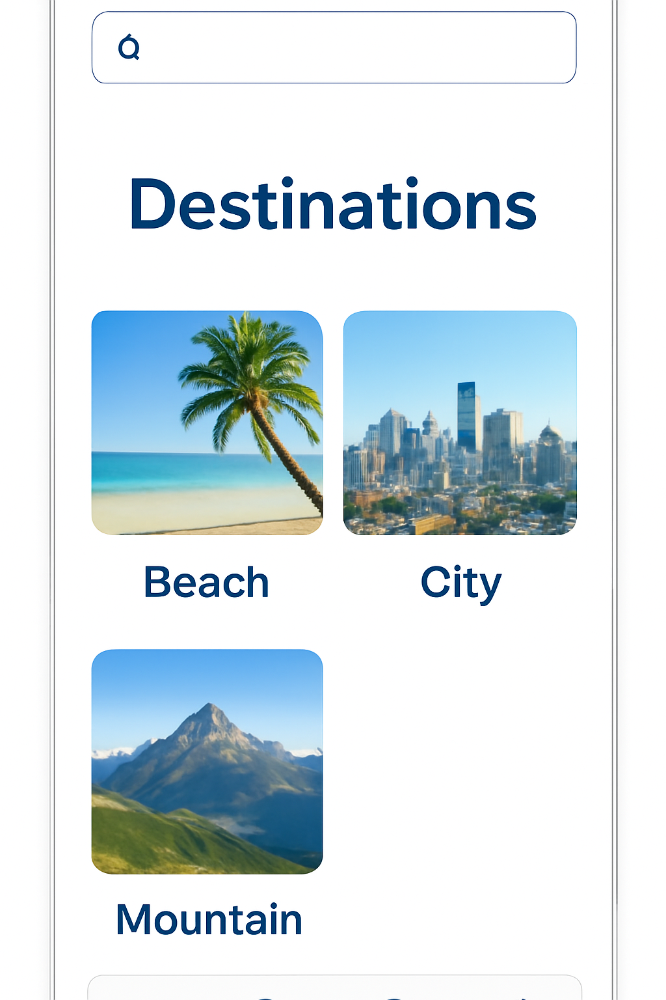
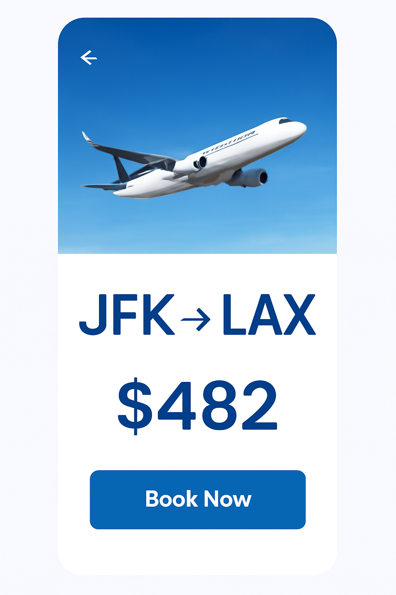
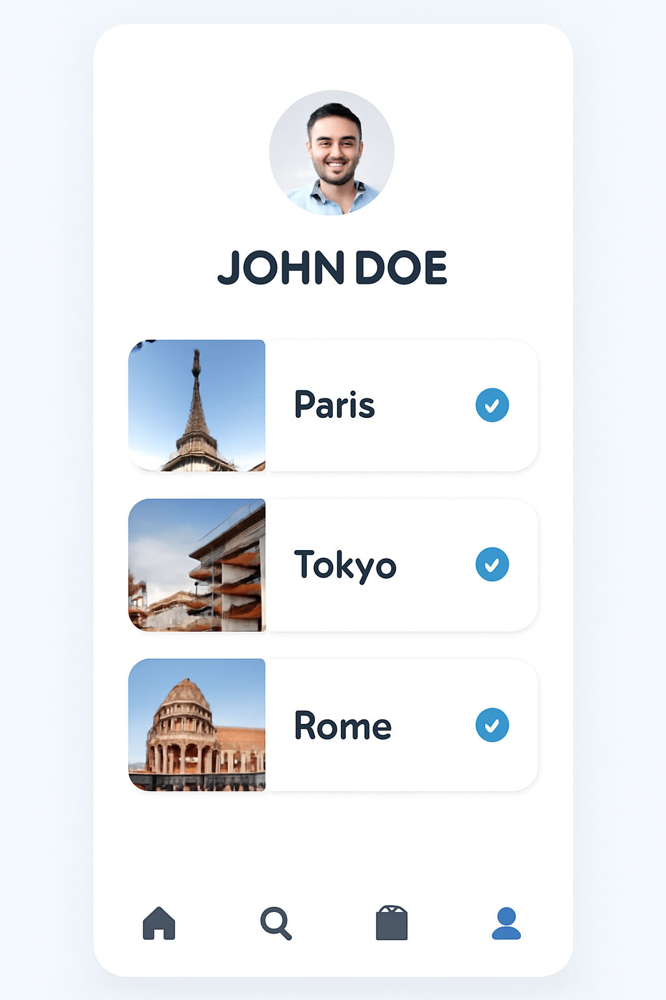

# B2-1 「AI 기반 UI/UX 디자인 시안 제작」 — 모범답안

> 미션 요구사항(최종 결과물 3종·기능 요구사항·보너스1·제약사항)을 **모두 충족**하도록
> 구성한 참고 모범답안(예시). 미션 원문은 [`문제.md`](문제.md) 참고.
> 채점 관점: 그럴듯한 이미지 3장이 아니라 **프롬프트 반복 개선 과정과 그 근거**가 핵심.

**사용 도구**: 네이토(codyssey.kr 학습앱 내장 AI 프록시, 백엔드 모델 `gpt-image-1-mini`
by OpenAI) — 이미지 생성. 같은 네이토의 챗 기능(`gemini-3-flash`)으로 보너스1(HTML/CSS
변환)도 처리. **Figma**는 프로토타입 배치 툴로 권장 사양 그대로 사용.
**레퍼런스**: 외부 이미지·디자인을 캡처/참고하지 않음 — 전부 텍스트 프롬프트로만 생성.

**Figma 프로젝트**: _(링크 추가 예정)_

---

## 0. 요구사항 충족 매핑 (셀프 체크)

### 최종 결과물 (필수 3종)

| 요구사항 | 충족 위치 | 상태 |
|---|---|---|
| UI 디자인 이미지 3장 이상 | `images/final/*.png` 3장 | ✅ |
| 모바일(9:16) 또는 웹(16:9) 비율 준수 | 전부 `1024x1536`(9:16) | ✅ |
| 화면 역할이 구분되는 구성(메인/목록/상세 등) | 메인(검색)·상세(예약)·마이페이지(예약 목록+프로필) 3역할 | ✅ |
| 이미지 내 텍스트 깨짐 수정된 상태 | 초안에서 발견된 깨짐을 최종본에서 전부 해소(작업로그 참고) | ✅ |
| 파일 형식 PNG/JPG | PNG | ✅ |
| 작업 로그 문서 1개(프롬프트 기록) | [`작업로그.md`](작업로그.md) | ✅ |
| 프롬프트 수정 과정(초안→수정→최종) | 화면 3개 전부 초안 1회+최종 1회, 문제점·수정방향·결과차이 기록 | ✅ |
| Figma 프로젝트(이미지 배치+hotspot/화면전환) | `captures/figma/`, 프로젝트 링크는 위에 채워넣을 예정 | ⬜ 진행 중 |

### 기능 요구 사항

| 요구사항 | 충족 위치 | 상태 |
|---|---|---|
| 이미지 생성 AI 도구 1개 이상 사용 | 네이토(백엔드: OpenAI `gpt-image-1-mini`) | ✅ |
| 최소 3개 화면 생성 | 3개 | ✅ |
| 모바일/데스크탑 일반 비율 준수 | 9:16 | ✅ |
| 프롬프트 개선 과정 문서 기록 | `작업로그.md` 화면별 초안→최종 | ✅ |
| 수정 이유·결과 차이 기록 | 동일 문서, 화면별 "문제"/"수정 방향"/"결과" 절 | ✅ |
| 뭉개진 글자·부자연스러운 요소 수정 | **방법: 인페인팅 툴 대신 프롬프트 재설계로 원천 회피**(작업로그 "공통 발견" 절에 근거 기록) — 결과물엔 깨진 텍스트 없음 | ✅ (대안적 방법, 정직하게 명시) |
| Figma로 이미지 배치 | 진행 중 | ⬜ |
| 화면 간 이동 흐름(hotspot/화면전환) | 진행 중 | ⬜ |

### 보너스 1 — 코드 변환 체험

| 요구사항 | 충족 위치 | 상태 |
|---|---|---|
| 완성 디자인을 HTML/CSS로 변환 | [`bonus/html-css/index.html`](bonus/html-css/index.html) (네이토 챗, `gemini-3-flash`) | ✅ |
| 변환 도구명 명시 | 네이토 챗(참고: 미션이 예로 든 V0/ChatGPT과 같은 성격의 코드생성 LLM) | ✅ |

### 제약 사항

| 요구사항 | 충족 위치 | 상태 |
|---|---|---|
| 사용 툴 이름 명시 | 위 "사용 도구" 절 | ✅ |
| Figma 권장 사양(또는 대체 툴+이유 명시) | Figma 그대로 사용 | ✅ |
| 레퍼런스 활용 시 출처 기록 | 레퍼런스 미사용(전부 프롬프트 생성) — 해당 없음 | ✅ (N/A) |
| 타인 작업물 무단 캡처 금지 | 외부 캡처 없음 | ✅ |
| 뭉개진 글자 등 수정 없이 제출 금지 | 최종본 전부 깨짐 없음(작업로그 검증) | ✅ |

---

## 1. 최종 디자인 3화면

### 메인 — 여행지 검색

검색바(아이콘만) + Destinations 카드 3개(Beach/City/Mountain) + 하단 아이콘 내비게이션.

### 상세 — 항공권 예약

항공기 배너 + `JFK → LAX` + `$482` + `Book Now` 버튼.

### 마이페이지 — 예약 내역

프로필(`JOHN DOE`) + 예약 3건(Paris/Tokyo/Rome, 체크 배지) + 하단 내비게이션.

`images/drafts/`에 위 3장의 초안(텍스트 깨짐 사례 원본)이 있다 — 자세한 프롬프트
변경 과정은 [`작업로그.md`](작업로그.md) 참고.

## 2. 과제 목표 자기 설명 (미션 원문 §3)

- **프롬프트 구성요소가 결과에 미치는 영향**: 텍스트 지시의 "길이"와 "글자 크기 암시"가
  가장 큰 변수였다. 큰 볼드 단문(1~3단어)은 거의 항상 정확히 렌더링됐고, 문단형 설명이나
  작은 다항목 라벨(좌석 선택 버튼 3개 등)은 거의 항상 깨졌다 — 스타일·색상·레이아웃 지시는
  비교적 안정적으로 반영됐지만 텍스트 정확도는 텍스트의 "양과 크기"에 크게 좌우됐다.
- **문제 식별·수정 방법**: 초안을 만들어 실제로 어떤 텍스트가 깨지는지 관찰 →
  깨진 텍스트의 공통 특징(길이·개수)을 패턴화 → 다음 프롬프트에서 그 패턴에 해당하는
  텍스트 요소 자체를 없애거나 극단적으로 단순화(1단어로 강제). 실제 인페인팅 도구는
  사용하지 않음.
- **일관성 유지 방법**: 시드 고정 대신, 3화면 모두 같은 스타일 키워드(clean minimal,
  blue and white, high-fidelity Figma-style UI, 9:16 portrait)를 프롬프트마다 반복
  사용해 톤을 맞췄다. 완전히 독립적으로 생성했기 때문에 화면 간 요소(아이콘 스타일 등)가
  미세하게 다를 수 있음 — 진짜 시드 고정/이미지 레퍼런스 기반 일관성은 개선 여지로 남김.
- **워크플로우**: 기획(화면 3개 역할 정의) → 이미지 생성(네이토, 초안→검토→최종) →
  후가공(프롬프트 재설계로 텍스트 문제 해결) → 프로토타입(Figma, hotspot) →
  (보너스) 코드 변환(네이토 챗).
